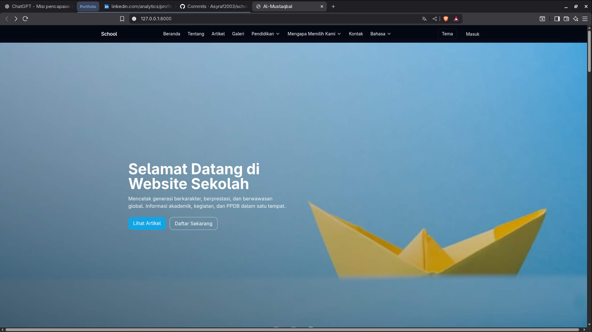
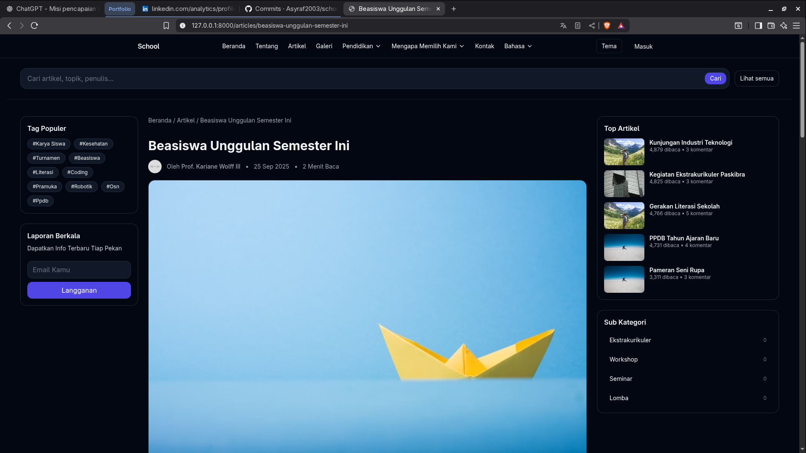
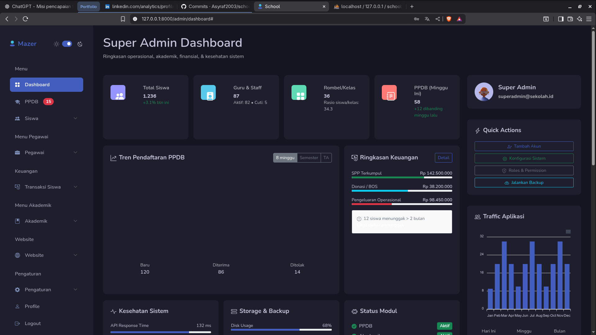

✨ SCHOOL WITH ARTICLE — Laravel 12 ✨
🚀 A modern school & article management system
🧱 Built with Laravel 12, TailwindCSS, Vite & MySQL
💻 Author: Asyraf — https://github.com/Asyraf2003
⭐ Repo: https://github.com/Asyraf2003/school-with-article
🖼️ Preview image: public/img/preview.png
License: MIT

🧩 TECH STACK
-
⚙️  PHP 8.2+ & Laravel 12
🗄️  MySQL / MariaDB
🎨  TailwindCSS + Vite
📦  Composer & npm

⚡ QUICK INSTALLATION
-
git clone https://github.com/Asyraf2003/school-with-article.git
cd school-with-article
composer install
cp .env.example .env
php artisan key:generate

--- ⚙️ DATABASE CONFIG (.env) ---
DB_CONNECTION=mysql
DB_HOST=127.0.0.1
DB_PORT=3306
DB_DATABASE=school_db
DB_USERNAME=root
DB_PASSWORD=
💡 Create DB manually:
mysql -u root -p -e "CREATE DATABASE school_db;"

--- ✉️ MAIL SETUP (.env) ---
MAIL_MAILER=smtp
MAIL_HOST=smtp.gmail.com
MAIL_PORT=587
MAIL_USERNAME=email@example.com
MAIL_PASSWORD=your_app_password
MAIL_ENCRYPTION=tls
MAIL_FROM_ADDRESS="email@example.com"
MAIL_FROM_NAME="${APP_NAME}"
💬 Tip: use Gmail “App Password” if 2FA enabled.

php artisan migrate --seed
php artisan storage:link
npm install && npm run build
php artisan serve

✅ Access: http://127.0.0.1:8000
🧠 USEFUL COMMANDS
-
▶ php artisan serve          → start dev server
▶ npm run dev                → hot reload frontend
▶ php artisan migrate:fresh  → reset database
▶ php artisan optimize:clear → clear cache

🩵 TROUBLESHOOTING
-
❗ Blank page → php artisan optimize:clear
❗ DB error   → check .env & MySQL service
❗ CSS/JS     → npm run dev or npm run build
❗ Mail error → verify Gmail App Password / SMTP

🧠 PRO TIP:
Add a banner or dashboard screenshot at:
  public/img/preview.png
It will appear beautifully on your GitHub repo page 🌈

  
  
  
  

